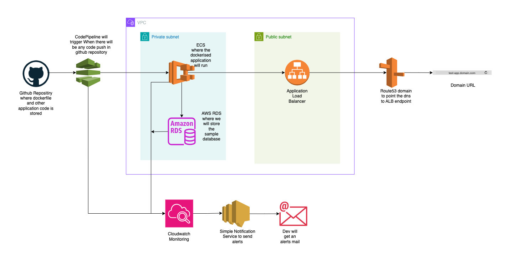

# AWS Case Study


## Description:
AWS case study diagram shows a simple architecture for deploying a containerized application using several AWS services. Here’s a concise explanation:

1. **GitHub:** The application code, including the Dockerfile, is stored in a GitHub repository.
2. **AWS CodePipeline:** Automatically triggered by any code changes in GitHub, CodePipeline builds and deploys the application.
3. **ECR:** CodeBuild stage in CodePipeline will build the docker image and push that image into ECR repository and in Deploy stage ECS will refer to that image.
4. **ECS (Elastic Container Service):** Runs the Dockerized application inside a private subnet, ensuring the application is isolated from public access.
5. **Amazon RDS:** Stores the application's sample database, also within the private subnet, for security and efficiency.
6. **Application Load Balancer (ALB):** Deployed in a public subnet, the ALB distributes incoming traffic from the internet to the application running in ECS.
7. **Route 53:** A domain is configured in Route 53 to direct traffic to the ALB, providing a user-friendly URL.
8. **Monitoring & Alerts:** CloudWatch monitors the infrastructure and Simple Notification Service (SNS) sends alerts to the developer/devops via email in case of issues.

This architecture supports scalability, security, and continuous integration and deployment (CI/CD).


## Refer below steps:

### Prepare a database:
1. Create a AWS MySQL RDS in private subnet.
2. Login to that RDS using below command
   ```
   mysql -h your-rds-endpoint.rds.amazonaws.com -u your-username -p
   ```
3. Once connected to the RDS instance, run the following SQL command to create a new database:
   ```
   CREATE DATABASE myappdb;
   USE myappdb;

   CREATE TABLE users (
       id INT AUTO_INCREMENT PRIMARY KEY,
       name VARCHAR(100),
       email VARCHAR(100)
   );

   INSERT INTO users (name, email) VALUES ('John Doe', 'john@example.com');
   INSERT INTO users (name, email) VALUES ('Jane Smith', 'jane@example.com');
   ```
4. For creating aws mysql RDS, Refer: https://docs.aws.amazon.com/AmazonRDS/latest/UserGuide/CHAP_GettingStarted.CreatingConnecting.MySQL.html#CHAP_GettingStarted.Creating.MySQL   

### Create application stack 
1. Create a ECR Repository
2. Use below commands to build the docker image and push into ECR
   ```
   aws ecr get-login-password --region <aws_region> | docker login --username AWS --password-stdin <account_id>.dkr.ecr.<aws_region>.amazonaws.com
   docker build -t <ecr_repo_name> .
   docker tag app-ecr-repo:latest <account_id>.dkr.ecr.<aws_region>.amazonaws.com/<ecr_repo_name>:<tag>
   docker push <account_id>.dkr.ecr.<aws_region>.amazonaws.com/<ecr_repo_name>:<tag>
   ```
3. Make sure where you are building this docker image should have ECR access. Refer: https://docs.aws.amazon.com/AmazonECR/latest/userguide/docker-push-ecr-image.html
4. Create ECS Cluster, ECS Task Definintion, ECS Service. In ECS service, you will get an options for creating security group, target group and application load balancer and listner.
5. To create ECS Cluster, refer https://docs.aws.amazon.com/AmazonECS/latest/developerguide/create-cluster-console-v2.html
6. To create ECS task definition, refer https://docs.aws.amazon.com/AmazonECS/latest/developerguide/task_definitions.html
7. In task definition, you also need to pass the env variables for MYSQL_HOST, MYSQL_USER, MYSQL_PASSWORD, MYSQL_DB
8. To create ECS service, refer https://docs.aws.amazon.com/AmazonECS/latest/developerguide/create-service-console-v2.html
9. You can view the webpage on browser using LoadBalancer endpoint

### Create CodePipeline as part of CICD
1. Create Codepipeline to automate the application deployment on ECS, Refer https://medium.com/thelorry-product-tech-data/end-to-end-cd-pipeline-amazon-ecs-deployment-using-aws-codepipeline-332b19ca2a9

### Monitoring Setup
1. Create a SNS topic https://docs.aws.amazon.com/sns/latest/dg/sns-create-topic.html
2. Create SNS subscription https://docs.aws.amazon.com/sns/latest/dg/sns-email-notifications.html
3. Create Cloudwatch Alarms for ECS https://docs.aws.amazon.com/AmazonECS/latest/developerguide/cloudwatch-metrics.html
4. Create Cloudwatch Alarms for RDS https://docs.aws.amazon.com/AmazonRDS/latest/UserGuide/monitoring-cloudwatch.html
5. Create Email Notification for CodePipeline https://docs.aws.amazon.com/codepipeline/latest/userguide/notification-rule-create.html
   

## Projected Cost

| | | | | | | | | | | | | | | | | | | | | | | | | | | | | | | | | |
|-|-|-|-|-|-|-|-|-|-|-|-|-|-|-|-|-|-|-|-|-|-|-|-|-|-|-|-|-|-|-|-|-|
|Name|Total Cost| | |Metadata| | | | |Groups| | | | | | | | | | | | | | | | | | | | | | | |
| |monthly|upfront|12 months|Currency|Locale|Created On|Legal Disclaimer|Share Url|Services| | | | | | | | | | | | | | | | | | | | | | | |
| | | | | | | | | |Service Name|Region|Status|Service Cost| | |Properties| | | | | | | | | | | | | | | | | |
| | | | | | | | | | | | |monthly|upfront|12 months|Storage amount|Storage for each RDS instance|Nodes|Instance type|Utilization (On-Demand only)|Deployment option|Pricing strategy|Operating system|CPU Architecture|Average duration|Number of tasks or pods|Amount of ephemeral storage allocated for Amazon ECS|Number of Application Load Balancers|Number of active pipelines of type V1 used per account per month|Requests|EMAIL/EMAIL-JSON Notifications|Number of Metrics (includes detailed and custom metrics)|Number of Standard Resolution Alarm Metrics|
|AWS Case Study Projected Cost|58.62|0.00|703.44|USD|en_US|08/10/2024|AWS Pricing Calculator provides only an estimate of your AWS fees and doesn't include any taxes that might apply. Your actual fees depend on a variety of factors, including your actual usage of AWS services.|https://calculator.aws/#/estimate?id=17c68fbf2ffb99ab3dfa94b23bdd37df90dfb866|Amazon RDS for MySQL|US East (N. Virginia)||14.71|0.00|176.52|20 GB|General Purpose SSD (gp3)|1|db.t3.micro|100 %Utilized/Month|Single-AZ|OnDemand| | | | | | | | | | | |
| | | | | | | | | |AWS Fargate|US East (N. Virginia)||4.44|0.00|53.28| | | | | | | |Linux|x86|15 days|1 per month|20 GB| | | | | | |
| | | | | | | | | |Application Load Balancer|US East (N. Virginia)||18.47|0.00|221.64| | | | | | | | | | | | |1| | | | | |
| | | | | | | | | |AWS CodePipeline|US East (N. Virginia)||14.00|0.00|168.00| | | | | | | | | | | | | |15| | | | |
| | | | | | | | | |Standard topics|US East (N. Virginia)||0.00|0.00|0.00| | | | | | | | | | | | | | |50 per month|50 per month| | |
| | | | | | | | | |Amazon CloudWatch|US East (N. Virginia)||7.00|0.00|84.00| | | | | | | | | | | | | | | | |20|10|
 

   


   
